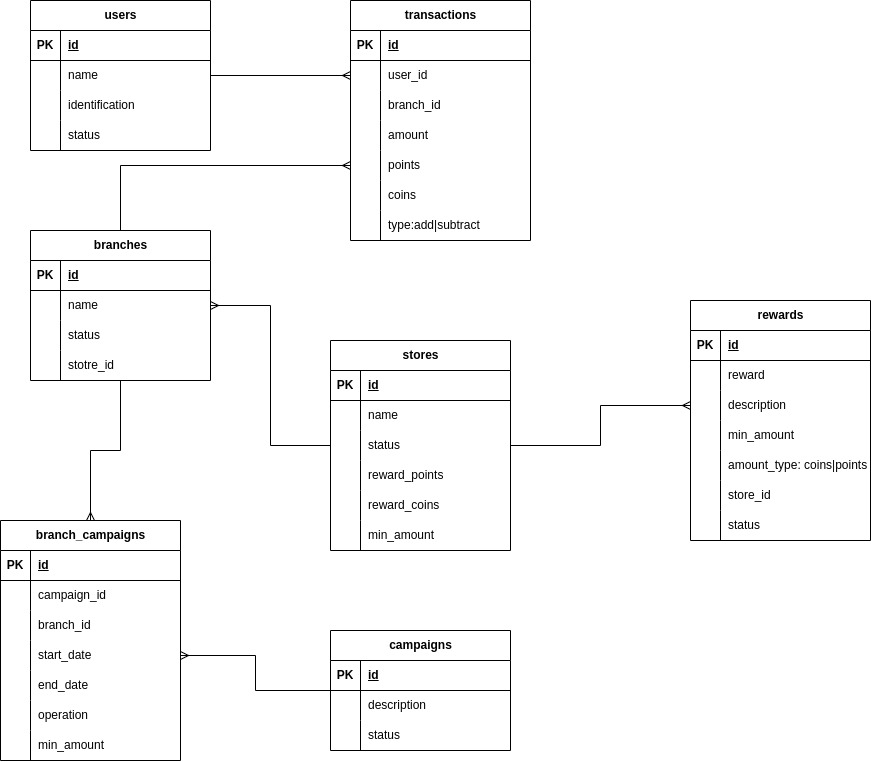

# Proyecto de lealtad

Implementación de api para acumular puntos y coins de un usuario de acuerdo
con las compras que este realiza y con los premios y recompensas que establecen
las tiendas registradas, a su vez permite que las tiendas puedan configurar dichas
recompensas y campañas para sus sucursales.

Su implementación se realizo utilizando golang utilizando arquitectura hexagonal 
para separar la lógica de negocio y asi evitar el acople a dependencias externas.

Las siguientes son algunas de las dependencias externas que se utilizan en este
proyecto:

- MYSQL: Utilizado para almacenar la información que se va registrando.
- Redis: Se utiliza para cachear la información  de determinadas consultas.

La siguiente captura muestra la arquitectura general de todo el proyecto:

Asi mismo en la siguiente captura se puede encontrar el diagrama de base de datos implementado:

## Dependencias y ejecución del proyecto

Todo el proyecto se encuentra dockerizado, por lo tanto es requerido tener `Docker` instalado.

Para su ejecución se debe realizar lo siguiente:

  1. Copiar el archivo duplicar el archivo `.env.example` y dejar el nombre del archivo como `.env`
  2. En la raíz del proyecto ejecutar el comando `docker compose up`, este comando levantara todo el proyecto
  3. verificar la documentación de la API que se puede encontrar en la ruta `http://localhost:{APP_PORT}/swagger/index.html` (tenga en cuenta que {APP_PORT} se debe cambiar por el puerto de la aplicación configurado en el archivo `.env`)
  4. Finalmente teniendo en cuenta la documentación puede probar la API rest por medio de algún cliente que le permita realizar peticiones 

